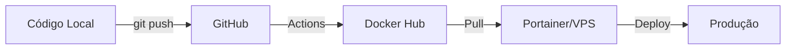

# 🐳 Guia Docker - Sistema de Controle de Produção

## 📋 Índice

1. [Pré-requisitos](#pré-requisitos)
2. [Desenvolvimento Local](#desenvolvimento-local)
3. [Produção com Docker Hub](#produção-com-docker-hub)
4. [Deploy no Portainer/VPS](#deploy-no-portainervps)
5. [Troubleshooting](#troubleshooting)

---

## 🔧 Pré-requisitos

### Desenvolvimento Local (Windows)
- [Docker Desktop](https://www.docker.com/products/docker-desktop/) instalado e rodando
- Git para clonar o repositório

### Produção
- Conta no [Docker Hub](https://hub.docker.com/)
- VPS com Docker e Portainer instalados
- Acesso ao GitHub para configurar Actions

---

## 💻 Desenvolvimento Local

### 1. Copiar variáveis de ambiente

```bash
cp .env.example .env
```

Edite o arquivo `.env` conforme necessário (valores padrão já funcionam).

### 2. Rodar com hot reload (recomendado para desenvolvimento)

```bash
docker compose -f docker-compose.dev.yml up --build
```

**Recursos:**
- ✅ Hot reload automático ao modificar código
- ✅ Volumes montados para edição em tempo real
- ✅ Banco de dados MySQL isolado
- ✅ Porta 5000 para aplicação
- ✅ Porta 3306 para MySQL (opcional, para acesso externo)

**Acesso:**
- Aplicação: http://localhost:5000
- MySQL: `localhost:3306` (usuário: `root`, senha: `root`)

### 3. Parar os containers

```bash
docker compose -f docker-compose.dev.yml down
```

Para remover também os volumes (dados do banco):
```bash
docker compose -f docker-compose.dev.yml down -v
```

---

## 🏗️ Produção com Docker Hub

### 1. Configurar Secrets no GitHub

Acesse **Settings → Secrets and variables → Actions** no seu repositório GitHub e adicione:

- `DOCKERHUB_USERNAME`: seu usuário do Docker Hub
- `DOCKERHUB_TOKEN`: token de acesso (crie em [Docker Hub → Account Settings → Security](https://hub.docker.com/settings/security))

### 2. Ajustar nome da imagem (se necessário)

Edite `.github/workflows/docker-publish.yml` e ajuste:

```yaml
env:
  IMAGE_NAME: ${{ secrets.DOCKERHUB_USERNAME }}/controle-producao
```

Se quiser outro nome, troque `controle-producao` pelo nome desejado.

### 3. Fazer push para o GitHub

O workflow irá:
1. ✅ Fazer build da imagem Docker
2. ✅ Publicar no Docker Hub com tags:
   - `latest` (sempre a versão mais recente da branch principal)
   - `main-{sha}` ou `master-{sha}` (commit específico)
   - Tags de versão se você criar releases (`v1.0.0`, `v1.0`, etc.)

```bash
git add .
git commit -m "feat: adicionar Docker e CI/CD"
git push origin main
```

### 4. Verificar no Docker Hub

Após alguns minutos, verifique em:
```
https://hub.docker.com/r/SEU_USUARIO/controle-producao
```

---

## 🚀 Deploy no Portainer/VPS

### 1. Preparar arquivo .env no Portainer

Crie um arquivo `.env` ou configure variáveis de ambiente diretamente no Portainer com:

```env
DOCKERHUB_USERNAME=seu_usuario
MYSQL_ROOT_PASSWORD=senha_segura_aqui
MYSQL_DATABASE=production_control
JWT_SECRET=chave_jwt_super_segura_aqui
APP_PORT=5000
DB_PORT=3306
VITE_APP_TITLE=Controle de Produção - NOBRE
```

### 2. Criar Stack no Portainer

1. Acesse **Stacks → Add stack**
2. Nomeie a stack (ex: `controle-producao`)
3. Cole o conteúdo de `docker-compose.prod.yml` ou use o repositório Git
4. Configure as **environment variables** com os valores acima
5. Clique em **Deploy the stack**

### 3. Atualizar aplicação

Quando houver nova versão no Docker Hub:

1. Acesse a stack no Portainer
2. Clique em **Pull and redeploy**
3. Ou via CLI na VPS:
   ```bash
   docker compose -f docker-compose.prod.yml pull
   docker compose -f docker-compose.prod.yml up -d
   ```

---

## 🔍 Troubleshooting

### Erro: "pnpm: not found"

**Causa:** Corepack não habilitado no container.  
**Solução:** O Dockerfile já resolve isso com `RUN corepack enable`.

### Erro de compilação do mysql2

**Causa:** Faltam dependências de build no Alpine.  
**Solução:** O Dockerfile já instala `python3 make g++`.

### Container reiniciando constantemente

**Causa:** Erro de conexão com banco ou variáveis faltando.  
**Verificar logs:**
```bash
docker logs CONTAINER_ID
```

**Solução comum:** verificar `DATABASE_URL` no `.env` ou nas variáveis do Portainer.

### Hot reload não funciona no Windows

**Causa:** WSL2 pode ter problemas com file watchers.  
**Soluções:**
1. Usar projeto dentro do WSL2 (`\\wsl$\Ubuntu\home\...`)
2. Ou ajustar no `package.json`:
   ```json
   "dev": "NODE_ENV=development tsx watch --poll server/_core/index.ts"
   ```

### Porta já em uso

**Causa:** Outro serviço usando 5000 ou 3306.  
**Solução:** Alterar no `.env` ou docker-compose:
```yaml
ports:
  - "5001:5000"  # Aplicação na porta 5001
```

---

## 📚 Comandos Úteis

```bash
# Ver logs em tempo real (desenvolvimento)
docker compose -f docker-compose.dev.yml logs -f app

# Acessar shell do container
docker compose -f docker-compose.dev.yml exec app sh

# Ver containers rodando
docker ps

# Limpar tudo (imagens, containers, volumes)
docker system prune -a --volumes

# Reconstruir forçando sem cache
docker compose -f docker-compose.dev.yml build --no-cache

# Rodar migrações do banco manualmente
docker compose -f docker-compose.dev.yml exec app pnpm db:push
```

---

## 🎯 Resumo do Fluxo Completo



1. **Desenvolvimento:** Edita código localmente com `docker-compose.dev.yml`
2. **Commit & Push:** Envia para GitHub
3. **CI/CD:** GitHub Actions faz build e publica no Docker Hub
4. **Deploy:** Portainer puxa imagem e atualiza stack em produção

---

## 📞 Suporte

- Documentação oficial: [RESTAURACAO.md](./RESTAURACAO.md)
- Issues conhecidos: [todo.md](./todo.md)
- Docker Hub: https://hub.docker.com
- Portainer Docs: https://docs.portainer.io
