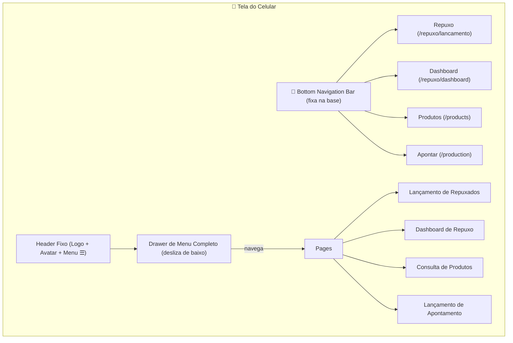
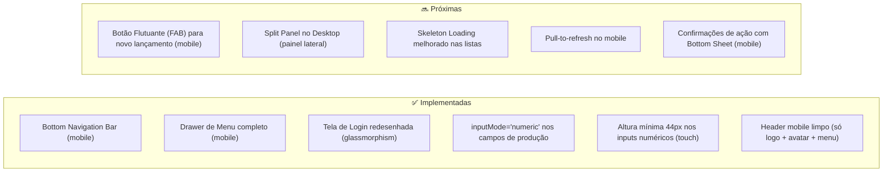
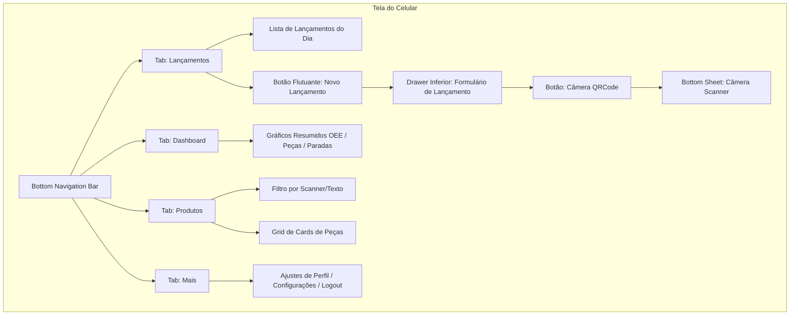

# Análise Geral e Propostas de Melhoria de UX/UI

Este documento apresenta uma análise detalhada da interface atual e as melhorias propostas e implementadas para elevar o design a um patamar premium, com foco em produtividade no **desktop** e experiência de **App Nativo** no mobile.

---

## 🗺️ Mapa de Fluxo: Arquitetura de Navegação Mobile (Implementada)

---

## 🗺️ Mapa de Fluxo: Melhorias por Área

---

## ✅ Melhorias Implementadas

### 1. 📱 Bottom Navigation Bar (Mobile)
**Arquivo:** `DashboardLayout.tsx`

Substituímos os botões de ícone no topo do header mobile por uma **Bottom Navigation Bar fixa** com as 4 telas de uso diário (Repuxo, Dashboard, Produtos, Apontar). O header mobile agora é limpo: apenas logo, avatar e botão de menu (`☰`).

- Toque amigável: cada aba tem `min-h-[44px]` (padrão Apple HIG)
- Aba ativa destacada em `indigo-600`
- Ícone cresce levemente ao selecionar (`scale-110`)
- Label reduzido (`10px`) abaixo do ícone (estilo iOS/Android nativo)
- Conteúdo principal recebe `pb-20` para não ficar atrás da barra

### 2. 🗂️ Drawer de Menu Completo (Mobile)
**Arquivo:** `DashboardLayout.tsx`

O botão `☰` no header abre um **Drawer** (desliza de baixo para cima) com todas as seções e subpáginas organizadas em grupos. Cada item tem:
- Altura mínima de `52px` (toque confortável)
- Estado ativo com fundo `indigo-50` e texto `indigo-700`
- Ícone colorido por seção

### 3. 🎨 Tela de Login Redesenhada
**Arquivo:** `Login.tsx`

Design premium com:
- Fundo: gradiente escuro `slate-900 → indigo-950 → slate-900`
- Card: efeito glassmorphism (`backdrop-blur-xl + bg-white/10 + border-white/15`)
- Círculos de luz decorativos no fundo
- Animação de entrada (`animate-in fade-in slide-in-from-bottom-4`)
- Inputs `h-12` com estilos glassmorphism e `rounded-xl`
- Botão de submit com micro-animação de escala (`active:scale-[0.98]`)
- `inputMode="email"` no campo de email (teclado email no mobile)

### 4. ⌨️ Inputs Numéricos Touch-Friendly
**Arquivos:** `LancamentoRepuxados.tsx`, `ProductsQuery.tsx`

Nos campos numéricos críticos (peças produzidas, peças quebradas, minutos de parada, diâmetro, espessura, ideal P/H, meta de quebra):
- Adicionado `inputMode="numeric"` → teclado numérico nativo no celular
- Adicionado `inputMode="decimal"` → teclado com vírgula decimal onde necessário
- Altura aumentada para `h-11` / `h-12` nos campos principais
- Validação de entrada que remove caracteres não numéricos

---

## 🔜 Próximas Melhorias Sugeridas

### Mobile
| Melhoria | Impacto | Complexidade |
|----------|---------|--------------|
| FAB (Botão Flutuante) para "Novo Lançamento" | ⭐⭐⭐ Alto | Médio |
| Pull-to-refresh nativo nas listas | ⭐⭐ Médio | Baixo |
| Confirmações de delete com Bottom Sheet | ⭐⭐ Médio | Baixo |
| Câmera em tela cheia (no lugar de modal) | ⭐⭐⭐ Alto | Médio |
| Swipe to delete nos itens de lançamento | ⭐⭐ Médio | Alto |

### Desktop
| Melhoria | Impacto | Complexidade |
|----------|---------|--------------|
| Split Panel (lista + detalhe lado a lado) | ⭐⭐⭐ Alto | Médio |
| Atalhos de teclado (ex: `Enter` para salvar) | ⭐⭐ Médio | Baixo |
| Skeleton Loading nas tabelas | ⭐⭐ Médio | Baixo |
| Filtros persistidos em localStorage | ⭐⭐ Médio | Baixo |
| Tooltips explicativos nas colunas de métricas | ⭐⭐ Médio | Baixo |

---

## 📐 Padrões de Design Adotados

- **Cor primária:** `indigo-600` (ações e estados ativos)
- **Altura mínima de toque:** `44px` (padrão Apple HIG / Material Design)
- **Fontes:** herança do sistema (`font-sans`)
- **Bordas:** `rounded-xl` (16px) nos cards principais, `rounded-lg` (12px) nos cards secundários
- **Sombras:** `shadow-md` padrão, `shadow-2xl` em modais e overlays
- **Glassmorphism:** usado na tela de login; pode ser expandido para modals

---

## 🗺️ Mapa de Fluxo: Arquitetura de Navegação Mobile Proposta

O diagrama abaixo ilustra como a navegação mobile deve ser organizada utilizando uma barra inferior fixa (Bottom Tabs) para emular o comportamento de um aplicativo nativo (iOS/Android):

---

## 📱 1. Versão Mobile (Experiência de App Nativo)

A versão mobile atual utiliza layouts adaptados da versão desktop (responsivos) por meio de colunas empilhadas. Para que ela pareça um **aplicativo nativo original**, propomos os seguintes padrões de design baseados nas diretrizes do iOS (Human Interface Guidelines) e Android (Material 3):

### A. Navegação por Abas Inferiores (Bottom Navigation Bar)
*   **Problema Atual**: O menu do sistema mobile fica escondido em um menu hambúrguer no topo da tela, exigindo 2 cliques e esticando o dedo do usuário até o topo.
*   **Proposta**: Adicionar uma barra de navegação inferior fixa com ícones e labels curtas (Lançar, Dashboard, Produtos, Configurações). Ela fica sempre acessível na "zona do polegar".

### B. Uso de Drawers / Bottom Sheets (Folhas de Conteúdo Inferior)
*   **Problema Atual**: Formulários e câmeras abrem em modais centralizados que esmagam as laterais do celular ou flutuam no meio do nada.
*   **Proposta**: Utilizar o componente `Drawer` do Shadcn/ui para todos os formulários rápidos e popups. Ao clicar em "Novo Lançamento", um painel desliza suavemente de baixo para cima, ocupando $90\%$ da tela, o que facilita muito o preenchimento com apenas uma mão.

### C. Leitor de Câmera Integrado
*   **Problema Atual**: A câmera de scanner abre em um popover ou janela flutuante menor.
*   **Proposta**: Abertura da câmera diretamente em tela cheia com overlay escuro simulando apps de leitura nativos, ou em um Drawer inferior dedicado que abre a câmera de forma fluida.

### D. Formulários e Inputs Otimizados para Touch
*   **Problema Atual**: Teclados padrão abrem em campos que só deveriam aceitar números, confundindo o operador.
*   **Proposta**:
    *   Adicionar `inputMode="decimal"` ou `inputMode="numeric"` em todos os inputs de peso, diâmetro, espessura e quantidades. Isso força o celular a exibir apenas o teclado numérico.
    *   Aumentar a área de toque dos botões (mínimo de $44\text{px} \times 44\text{px}$).

---

## 💻 2. Versão Desktop (Painel de Alta Produtividade)

No desktop, a prioridade máxima é a densidade de dados e a velocidade de operação sem cliques desnecessários.

### A. Painel Lateral de Detalhes (Sidepanel / Split Panel)
*   **Problema Atual**: Para visualizar ou editar os detalhes completos de um produto ou lançamento, o usuário precisa abrir um modal centralizado que bloqueia o fundo.
*   **Proposta**: Implementar um layout do tipo Split. Ao clicar em uma linha da tabela de produtos, um painel lateral desliza da direita para a esquerda exibindo os detalhes adicionais, permitindo que a tabela à esquerda permaneça totalmente visível e interativa.

### B. Expansão das Ações no Grid Inline
*   **Problema Atual**: Algumas telas de edição exigem abrir modais para alterar pequenas informações.
*   **Proposta**: Expandir o uso de tabelas editáveis (como o `react-data-grid` implementado em `ProductsQuery.tsx`) para o controle de paradas e metas de produção, acelerando as rotinas operacionais diárias.

### C. Filtros Globais Consolidados
*   **Problema Atual**: Filtros espalhados ou que exigem múltiplos botões de aplicar.
*   **Proposta**: Barra superior unificada contendo filtros rápidos (Período, Repuxador, Máquina) que atualizam em tempo real todos os dados da página através de debouncing.

---

## 🛠️ 3. Próximos Passos Recomendados para Desenvolvimento

1.  **Divisão de Arquivos Mobile/Desktop**:
    *   Refatorar páginas muito grandes (como `LancamentoRepuxados.tsx` que possui mais de $2.000$ linhas) dividindo a lógica em subcomponentes separados: `LancamentoDesktop.tsx` e `LancamentoMobile.tsx`. Isso reduz o tamanho dos pacotes de carregamento e melhora drasticamente a organização do código.
2.  **Criação de um Layout Base Mobile**:
    *   Criar um componente `MobileAppLayout.tsx` contendo a Bottom Navigation e o header nativo com botões integrados para facilitar a transição rápida entre telas no celular.
