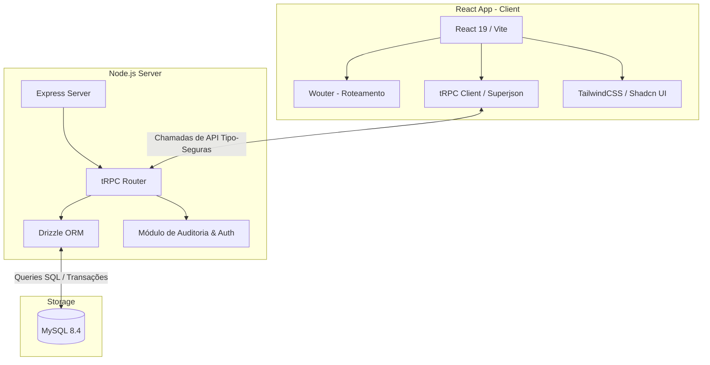
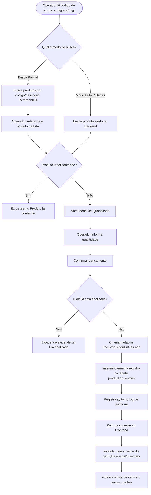

# Análise Completa de Arquitetura e Diagnóstico de Bugs - Antigravity

Este documento apresenta uma análise detalhada da arquitetura do **Sistema de Controle de Produção - NOBRE**, o mapeamento de fluxos de dados, o diagnóstico do principal bug relatado no `todo.md` e a proposta de próximos passos.

---

## 📊 Arquitetura Geral do Sistema

O sistema é construído sobre uma stack moderna baseada em TypeScript de ponta a ponta:



---

## 🔄 Fluxo de Lançamento de Produção

O diagrama abaixo detalha a jornada do usuário operador ao realizar o lançamento de um produto na tela de Produção:



---

## 🔍 Diagnóstico do Bug: Itens Lançados que Não Aparecem na Tela

No arquivo `todo.md`, foi relatado o seguinte bug prioritário:
> **Problema**: Itens lançados não aparecem na seção "Itens Lançados" da página de Produção, embora o resumo no topo exiba a quantidade total de itens e soma corretas e o backend tenha os dados salvos.

### 🔴 Causa Raiz Encontrada
Analisando o arquivo `client/src/pages/ProductionEntry.tsx`, identificamos o seguinte trecho nas linhas 125-128:

```typescript
  const { data: entriesData } = trpc.productionEntries.getByDate.useQuery(
    { date: targetDate },
    { enabled: isDayOpen }
  );
```

E o valor de `isDayOpen` é calculado a partir do status do dia (linha 113-117):

```typescript
  const { data: dayStatus } = trpc.snapshots.getStatus.useQuery(
    { date: targetDate }
  );

  const isDayOpen = dayStatus?.isOpen ?? true;
```

**O que acontece:**
1. Quando o operador finaliza o dia de produção, é gerado um snapshot do dia, alterando `isOpen` para `false` no banco de dados.
2. O endpoint `trpc.snapshots.getStatus` retorna `isOpen: false`, fazendo com que `isDayOpen` seja `false` no frontend.
3. Como consequência imediata, a opção `enabled: isDayOpen` **desativa** a query `getByDate`.
4. Uma query desativada retorna `data: undefined` para o React. Por isso, a lista de itens desaparece da UI, enquanto a query de resumo (`getSummary`, que roda sempre sem essa restrição) continua mostrando o total de itens e soma corretos no topo.

Além disso, se a consulta de `dayStatus` estiver carregando de forma assíncrona ou lenta, pode haver oscilação do valor, ocultando os itens momentaneamente.

### 🟢 Solução Proposta
A query `getByDate` **deve rodar sempre**, independente do dia estar aberto ou fechado, para permitir a leitura histórica dos lançamentos. O bloqueio de edições em dias fechados já é tratado corretamente através da variável `isDayFinalized` (que desabilita os botões de edição, exclusão e adição na UI).

Basta alterar a declaração no frontend em `ProductionEntry.tsx` para:

```typescript
  const { data: entriesData } = trpc.productionEntries.getByDate.useQuery(
    { date: targetDate }
  );
```

---

## 🚀 Próximos Passos (Plano de Ação)

Com base no `todo.md` e no estado atual do codebase, as prioridades para continuar o desenvolvimento são:

1. **Correção do Bug Prioritário**: Remover a restrição `enabled: isDayOpen` do hook `getByDate.useQuery` no frontend.
2. **Implementar Novas Funcionalidades Solicitadas (Tela Importar)**:
   - Adicionar o botão "+ Incluir Produto" na tela de gerenciar produtos (manual).
   - Validar descrições para forçar caixa alta (UPPERCASE).
3. **Mapeamento Flexível**:
   - Ajustar a importação em lote para aceitar novos mapeamentos opcionais ou adicionais no mapeamento da planilha.
4. **Modelo de Histórico**:
   - Garantir que todas as adições de produção preencham a tabela `product_history` para geração de relatórios de variação e KPIs futuros.

---

Este arquivo foi gerado para auxiliar na continuidade do desenvolvimento local com máxima fidelidade e robustez técnica.
