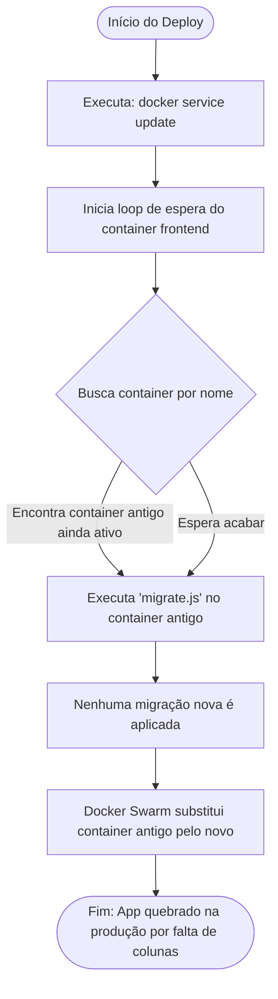
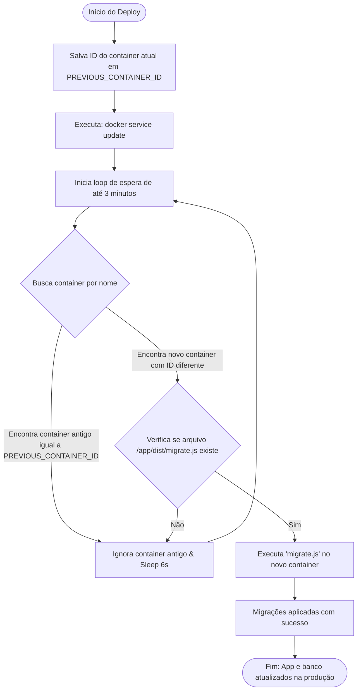

# 🔍 Análise de Falha e Correção do Script de Migração Automática no Deploy

Este documento detalha o diagnóstico do erro ocorrido no deploy automático, onde as migrações de banco de dados não foram executadas no ambiente de produção, e descreve a solução implementada para evitar novas falhas.

---

## 🛑 O Problema Diagnosticado

Durante a atualização do sistema no ambiente de produção:
1. O repositório foi atualizado via Git e iniciou o pipeline do GitHub Actions.
2. O pipeline efetuou o `docker stack deploy` e solicitou a atualização do serviço `controle-de-producao_frontend` via Docker Swarm.
3. No entanto, o Docker Swarm executa a atualização de forma **assíncrona**. Ele leva alguns segundos para baixar a imagem nova, criar as novas tarefas e iniciar o container atualizado.
4. Logo no milissegundo seguinte ao comando de update, o loop de espera do GitHub Actions tentou encontrar o container do frontend.
5. Como o container **antigo** ainda estava ativo e rodando (e possuía o arquivo `/app/dist/migrate.js` das versões anteriores), o script o identificou como "pronto".
6. As migrações novas (`006`, `007` e `008`) foram tentadas dentro do container **antigo** (que não tinha os arquivos SQL novos dentro do seu volume ou código interno), resultando em nenhuma migração aplicada.
7. O container antigo foi finalmente destruído pelo Swarm e substituído pelo novo, mas a etapa de migração já havia passado.

---

## 🗺️ Mapa de Fluxo (Comportamento Anterior vs. Corrigido)

### ❌ Fluxo Anterior (Com Concorrência)


###  Fluxo Corrigido (Garantia do Novo Container)


---

## 🛠️ A Solução Aplicada

Modificamos o workflow do GitHub Actions em [docker-publish.yml](file:///c:/Users/feliperosa/controle-de-producao/Controle-de-Producao/.github/workflows/docker-publish.yml):

1. **Captura do ID Atual:** Antes de disparar o deploy, salvamos o ID do container ativo:
   ```bash
   PREVIOUS_CONTAINER_ID=$(docker ps --filter "name=controle-de-producao_frontend" -q | head -n1)
   ```
2. **Filtro de Diferenciação:** No loop de verificação, só aceitamos um container cujo ID seja diferente do anterior:
   ```bash
   if [ -n "$CONTAINER_ID" ] && [ "$CONTAINER_ID" != "$PREVIOUS_CONTAINER_ID" ]; then
   ```
3. **Margem de Tempo Estendida:** Aumentamos o número de tentativas de `15` para `30` (até 3 minutos) para garantir tempo suficiente para o download da imagem e inicialização do container.
4. **Validação de Sucesso Estrita:** Se ao final do loop o container ativo ainda for igual ao antigo ou nulo, o deploy quebra imediatamente e acusa falha no GitHub Actions.
