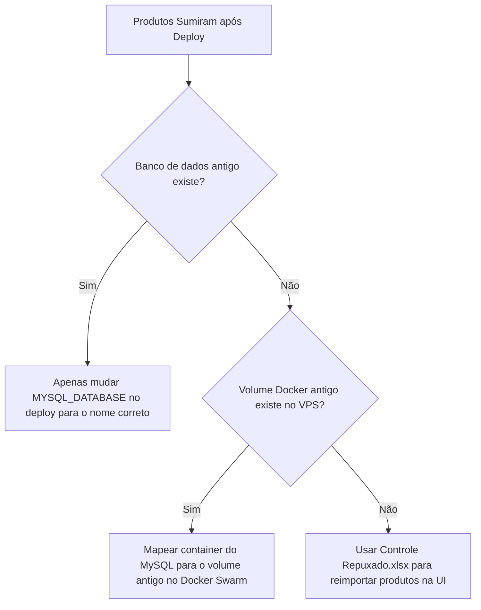

# Diagnóstico e Restauração de Dados em Produção

Este documento detalha as hipóteses do sumiço de produtos em produção após o deploy e fornece o fluxo passo a passo para diagnosticar e restaurar os dados com segurança.

## Mode
N2 (Critical - Data Integrity Impact)

## Fluxo de Diagnóstico



## Hipóteses do Sumiço dos Dados

A migração criada (`008_motivos_parada.sql`) executa apenas comandos de criação (`CREATE TABLE IF NOT EXISTS`) e adição de coluna (`ALTER TABLE ADD COLUMN`). **Ela não contém comandos de deleção (DROP ou TRUNCATE)**, portanto é fisicamente impossível que o script SQL de migração tenha apagado a tabela de produtos. 

As duas causas prováveis estão no ecossistema do deploy automático (Docker Swarm / VPS):

1. **Alteração do Nome do Banco de Dados (`MYSQL_DATABASE`):** 
   Se o banco de dados que estava em execução anteriormente em produção tinha um nome (ex: `controle_producao`, `nobre_luminarias`, etc.) e o deploy mais recente utilizou a variável default `production_control` (seja por falta de configuração de Secrets no GitHub Actions ou reset de envs), o MySQL criou um novo banco de dados vazio e rodou as migrations nele.
   *Nesse caso, seus dados antigos continuam totalmente intactos sob o nome da base de dados antiga.*

2. **Troca ou Recriação do Volume do Docker:**
   O Docker Swarm utiliza volumes locais (`db_data_prod`). Se o container do MySQL foi reiniciado/recriado com o comando `docker stack deploy` e por algum motivo o volume anterior foi removido (`docker volume rm`) ou o container foi agendado em outro nó da VPS que não tinha o volume correspondente no disco, o Docker criou um volume novo zerado.

---

## Passo a Passo para Diagnóstico e Restauração no VPS

Acesse o terminal da sua VPS via SSH e execute os diagnósticos abaixo:

### Passo 1: Listar as bases de dados existentes no MySQL
Execute o comando abaixo para verificar se a sua base de dados antiga (com os produtos) ainda existe com outro nome no MySQL:

```bash
# Obter ID do container do banco
DB_CONTAINER=$(docker ps --filter "name=controle-de-producao_backend" -q | head -n1)

# Listar todas as bases de dados
docker exec -it "$DB_CONTAINER" mysql -u root -p -e "SHOW DATABASES;"
```
*(Se pedir senha, digite a senha correspondente ou execute sem `-p` caso não utilize senha).*

- **Se você encontrar um banco com outro nome (ex: `controle_producao`):**
  1. Vá nas configurações do repositório no GitHub (Settings -> Secrets and Variables -> Actions).
  2. Altere a Secret `MYSQL_DATABASE` para o nome exato do banco que você encontrou.
  3. Rode a pipeline de deploy novamente. Os dados antigos reaparecerão no sistema imediatamente.

### Passo 2: Listar volumes do Docker no VPS
Verifique se o volume antigo que guardava os dados do MySQL ainda está preservado no disco da VPS:

```bash
docker volume ls
```

Se você identificar um volume órfão correspondente ao banco antigo (por exemplo, `controle-de-producao_db_data_prod` ou similar), podemos ajustar a definição da stack no arquivo `docker-compose.swarm.yml` do VPS para apontar para o nome exato desse volume antigo.

---

## Restauração via Planilha (Backup)

Se o volume do banco de dados de produção foi realmente excluído do VPS e você não possui um dump SQL de backup recente, a planilha do Excel local do repositório **[Controle Repuxado.xlsx](file:///c:/Users/feliperosa/controle-de-producao/Controle-de-Producao/Controle%20Repuxado.xlsx)** (com 166KB de tamanho) atua como seu backup de produtos.

Para restaurá-los:
1. Acesse o sistema em produção pelo seu navegador.
2. Navegue até o menu lateral e selecione **Importar Produtos** (ou correspondente).
3. Faça o upload do arquivo **`Controle Repuxado.xlsx`** localizado na raiz do seu projeto.
4. Mapeie as colunas de código, descrição e peso conforme solicitado pela interface do importador e conclua a importação. O banco em produção será repovoado automaticamente com todos os produtos.
