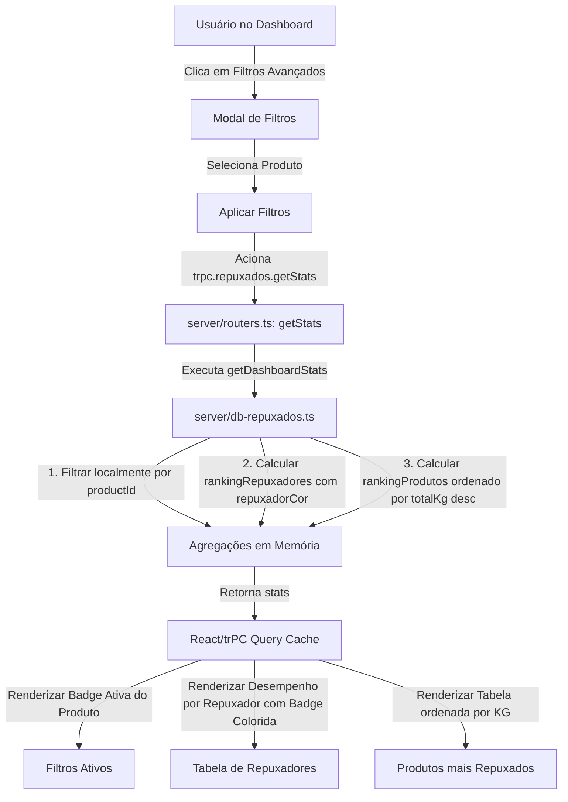
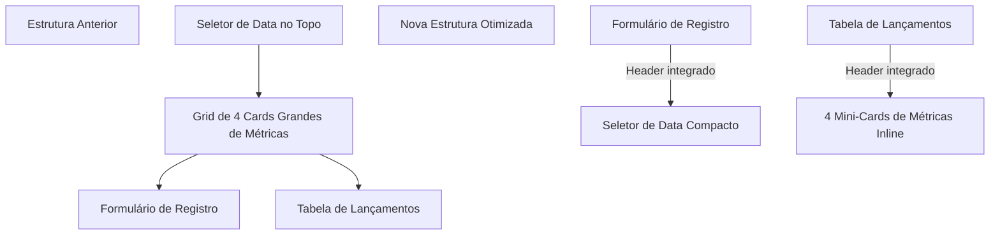

# Implementação de Filtros de Produto, Cores e Ajustes de Layout no Lançamento

Esta documentação descreve as melhorias implementadas no Dashboard de Repuxo e na tela de Lançamento de Repuxados para habilitar a análise de qual produto foi mais repuxado, além de destacar visualmente qual operador mais repuxou através de cores personalizadas e otimizar a disposição visual da tela de lançamentos.

---

## 🗺️ Mapa de Fluxo de Dados e Componentes

Abaixo é apresentado o fluxo de dados desde os filtros no frontend, passando pelas queries de backend trPC, até a renderização dos Rankings no Dashboard.

---

## 📐 Reestruturação do Layout de Lançamentos

Para aumentar a área útil e melhorar a usabilidade em telas menores, reorganizamos a tela de Lançamento de Repuxados da seguinte forma:

---

## 🛠️ Alterações Efetuadas

### 1. Dashboard (`DashboardRepuxo.tsx` & `server/db-repuxados.ts`)
- **Badge Ativa de Produto**: Exibe a badge do produto selecionado sob os filtros ativos com opção de limpeza rápida.
- **Destaque por Cores no Ranking**: Inclusão de um círculo colorido (`r.cor || "#6366f1"`) ao lado do nome do operador no ranking "Desempenho por Repuxador".
- **Ranking de Produtos mais Repuxados**: Card de largura total detalhando peso, peças e taxa de refugo dos produtos.

### 2. Lançamento de Repuxados (`LancamentoRepuxados.tsx`)
- **Métricas no Header**:
  - Remoção da grid de 4 cards de métricas do topo da tela.
  - Inclusão dessas métricas direto no cabeçalho do card "Lançamentos do Dia", organizadas de forma inline e compacta (estética premium com fundo colorido semitransparente e ícones alinhados).
- **Seletor de Data**:
  - Remoção do seletor de data do topo da página.
  - Inserção do seletor de data direto no cabeçalho do formulário "Registrar Lote de Produção" (lado direito, ao lado do botão de cancelar edição), otimizando o fluxo de preenchimento.
