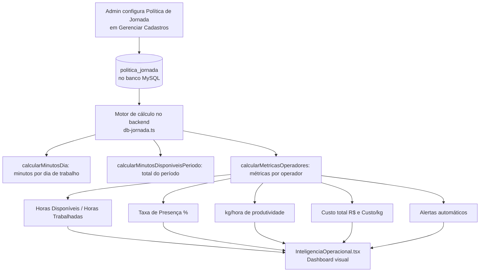

# 🏭 Inteligência Operacional — Jornada de Trabalho

## Objetivo
Módulo para controle inteligente da política de jornada de trabalho da fábrica,
com cálculo automático de horas disponíveis, presença, produtividade e custo por operador.

## Arquivos Criados/Modificados

| Arquivo | Ação |
|---|---|
| `migrations/008_politica_jornada.sql` | CRIADO — Migration SQL + seed da política padrão |
| `drizzle/schema.ts` | MODIFICADO — Tabela `politicaJornada` adicionada |
| `server/db-jornada.ts` | CRIADO — CRUD + motor de cálculo de jornada |
| `server/routers.ts` | MODIFICADO — Routers `politicaJornada` e `inteligenciaOperacional` |
| `client/src/pages/InteligenciaOperacional.tsx` | CRIADO — Dashboard de métricas |
| `client/src/pages/GerenciadorCadastros.tsx` | MODIFICADO — Aba "Jornada" adicionada |
| `client/src/components/DashboardLayout.tsx` | MODIFICADO — Item de menu adicionado |
| `client/src/App.tsx` | MODIFICADO — Rota `/repuxo/inteligencia` |

## Fluxo do Módulo



## Política Padrão Seed

```
Descrição: Política Padrão Nobre
Seg-Qui: 07:30–12:00 / 13:00–17:30 (9h/dia)
Sexta:   07:30–12:00 / 13:00–16:30 (8h/dia)
Sábado/Domingo: NÃO TRABALHA
Jornada semanal: 44h
Estimativa mensal: ~190h/operador
```

## Métricas Calculadas

| Métrica | Fórmula |
|---|---|
| Horas Disponíveis | `Σ minutosDisponiveis(dia) / 60` para cada dia útil |
| Horas Trabalhadas | `Σ (horaFim - horaInicio)` de cada lançamento |
| Taxa de Presença | `Horas Trabalhadas / Horas Disponíveis × 100` |
| Produção/Hora | `totalKg / Horas Trabalhadas` |
| Custo Total | `Horas Trabalhadas × custo_hora` |
| Custo/KG | `Custo Total / totalKg` |
| Dias Trabalhados | `count(DISTINCT dataProducao)` |
| Dias Ausentes | `Dias Úteis - Dias Trabalhados` |

## Alertas Automáticos

| Condição | Alerta |
|---|---|
| Taxa Presença < 80% | ⚠️ Taxa de presença baixa |
| OEE < 50% | 🔴 OEE crítico |
| Quebra > 2.5% | ⚠️ Refugo acima da meta |
| kg/hora < 10 | 📉 Produtividade baixa |

## Navegação

- Menu: **Repuxo → Inteligência Operacional**
- URL: `/repuxo/inteligencia`
- Cadastro: **Repuxo → Gerenciar Cadastros → aba Jornada**
