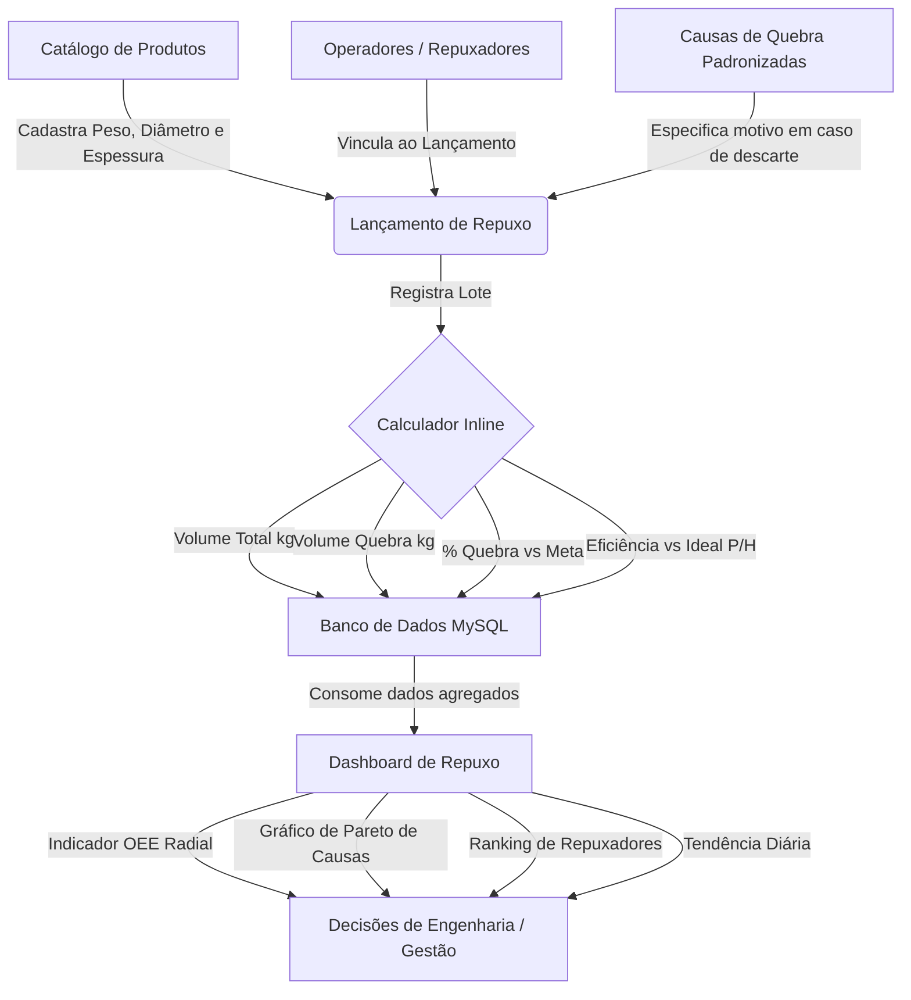

# Módulo de Controle de Produção de Repuxados

Este documento detalha o fluxo de dados, a arquitetura e o funcionamento do módulo de **Repuxados** implementado no sistema.

## 📌 Visão Geral
O módulo foi projetado para gerenciar a produção de itens repuxados, rastreando operadores (repuxadores), tempos de operação, paradas de máquina e desperdício (peças e peso de quebra). O sistema calcula automaticamente o **OEE (Overall Equipment Effectiveness)** de cada lote e gera gráficos de Pareto e rankings de produtividade.

---

## 🔄 Mapa de Fluxo de Dados

---

## 📊 Arquitetura do Banco de Dados

Novas tabelas e campos inseridos para suportar o módulo:

### 1. Extensão na tabela `products`
* `peso_unitario_g` (DECIMAL): Peso unitário de cada peça em gramas (usado para converter quantidade produzida em KG).
* `diametro_mm` (DECIMAL): Diâmetro físico da peça em milímetros.
* `espessura_mm` (DECIMAL): Espessura física do material em milímetros.
* `ideal_pecas_hora` (INT): Produtividade ideal de peças por hora para cálculo de Performance.
* `meta_quebra_pct` (DECIMAL): Limite máximo aceitável de quebras para o produto.

### 2. Tabela `repuxadores`
Armazena os operadores da máquina de repuxo (Nome, Matrícula, Turno Padrão e se está Ativo).

### 3. Tabela `causas_quebra`
Cadastro padronizado de motivos que levam a peças quebradas (ex: Setup de Máquina, Falta de Material, Defeito na Matéria-Prima, etc.).

### 4. Tabela `producao_repuxados`
Registro central de cada lote produzido. Vincula o produto, operador, data, turno, horários de início/fim, peças boas e peças quebradas.

### 5. Tabela `paradas_maquina`
Registra tempos de paradas de máquina em minutos associadas a um lote específico, permitindo o cálculo correto de Disponibilidade no OEE.

### 6. Tabela `metas_repuxo`
Cadastro de metas diárias de KG produzido e limites de desperdício por vigência periódica.

---

## ⚙️ Lógica de Cálculo do OEE (Overall Equipment Effectiveness)

O OEE é calculado a nível de lote e consolidado no Dashboard com base na seguinte fórmula:

$$\text{OEE} = \text{Disponibilidade} \times \text{Performance} \times \text{Qualidade}$$

1. **Disponibilidade**:
   $$\text{Disponibilidade} = \frac{\text{Tempo Operando}}{\text{Tempo Total do Turno}}$$
   * *Tempo Total do Turno*: Diferença entre a Hora Fim e a Hora Início em minutos.
   * *Tempo Operando*: Tempo Total do Turno subtraído pelo total de minutos de paradas de máquina lançados no lote.

2. **Performance**:
   $$\text{Performance} = \frac{\text{Peças Produzidas}}{\text{Tempo Operando (horas)} \times \text{Peças/Hora Ideal}}$$
   * Compara o ritmo real do operador com a capacidade cadastrada na ficha técnica do produto.

3. **Qualidade**:
   $$\text{Qualidade} = \frac{\text{Peças Boas}}{\text{Peças Produzidas}}$$
   * *Peças Boas*: Peças Produzidas subtraído pelas Peças Quebradas.
