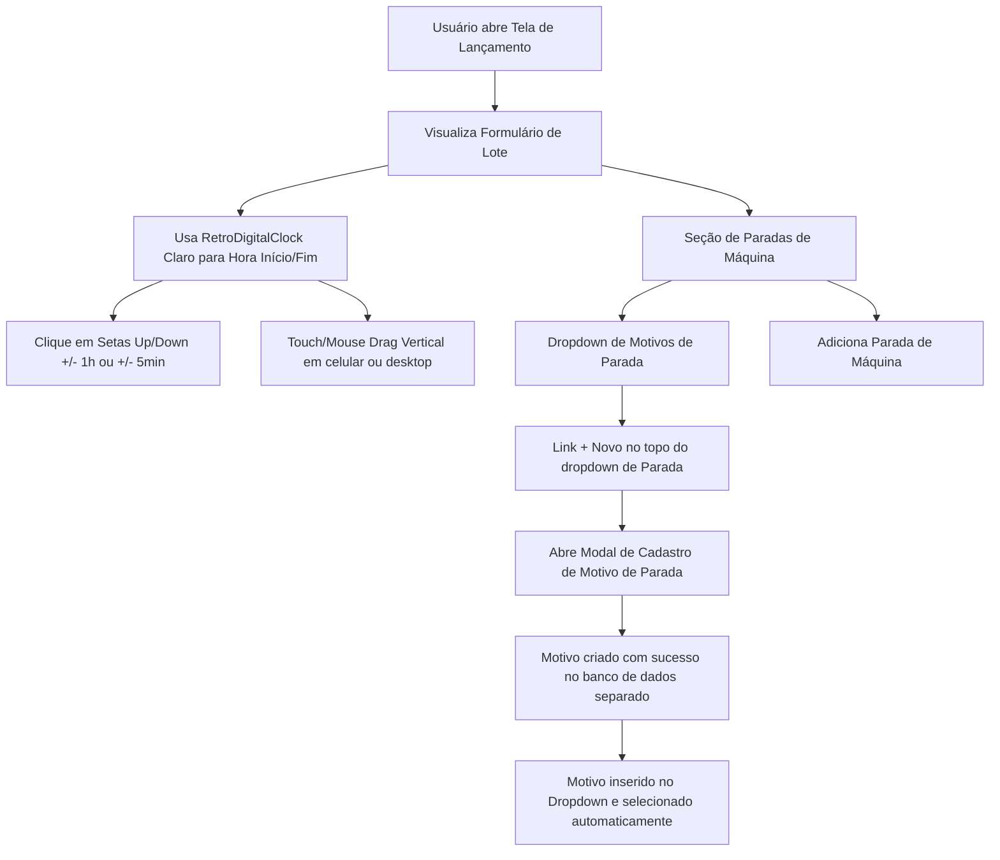

# Plano de Implementação - Reestruturação de Lançamento de Repuxados e Relógios Digitais Retrô

## Objective
Reestruturar a criação de paradas de máquina para que ocorra de forma padronizada através de um modal e uma base de dados separada da de causas de quebra de produtos. Mudar o tema visual dos novos relógios digitais retrô para um layout claro.

## Mode
N1 (Production)

## Plan & Fluxo

## Changes

1. **`RetroDigitalClock` - Tema Claro**:
   - Ajustada a estilização em [LancamentoRepuxados.tsx](file:///c:/Users/feliperosa/controle-de-producao/Controle-de-Producao/client/src/pages/LancamentoRepuxados.tsx) para adotar um fundo claro (`bg-slate-100/80`), com caixas brancas (`bg-white`), bordas suaves e fontes escuras (`text-slate-800`).

2. **Bases de Dados Separadas**:
   - Criada a migração [008_motivos_parada.sql](file:///c:/Users/feliperosa/controle-de-producao/Controle-de-Producao/migrations/008_motivos_parada.sql) para criar a tabela `motivos_parada` e adicionar `motivo_parada_id` à tabela `paradas_maquina`.
   - Atualizado o arquivo [schema.ts](file:///c:/Users/feliperosa/controle-de-producao/Controle-de-Producao/drizzle/schema.ts) do Drizzle com a nova definição de `motivosParada` e relacionamento em `paradasMaquina`.
   - Modificado [db-repuxados.ts](file:///c:/Users/feliperosa/controle-de-producao/Controle-de-Producao/server/db-repuxados.ts) para implementar o CRUD completo de `motivos_parada` e realizar joins corretos na listagem.
   - Atualizado o [routers.ts](file:///c:/Users/feliperosa/controle-de-producao/Controle-de-Producao/server/routers.ts) do TRPC com o sub-router `motivosParada` e mapeamento de inputs.

3. **Modal Dinâmico no Frontend**:
   - Ajustado o modal de Nova Causa/Motivo em [LancamentoRepuxados.tsx](file:///c:/Users/feliperosa/controle-de-producao/Controle-de-Producao/client/src/pages/LancamentoRepuxados.tsx) para mudar títulos e labels dinamicamente dependendo da origem (`causaModalOrigin === "parada"`).

## Edge Cases
- **Compatibilidade Retroativa**: A coluna antiga `causa_quebra_id` de `paradas_maquina` e a digitação de texto `motivo` foram mantidas no banco para não invalidar dados históricos anteriores.

## Security & Data
- Separação lógica limpa entre dois conceitos distintos: defeitos de produção (quebras) e interrupções operacionais de processo (paradas de máquina).

## Tests & Validation
- O projeto foi validado com o utilitário `pnpm run check` para atestar a correção de tipos.

## Rollback
- Utilizar `git checkout` para reverter as alterações nos arquivos se necessário.
