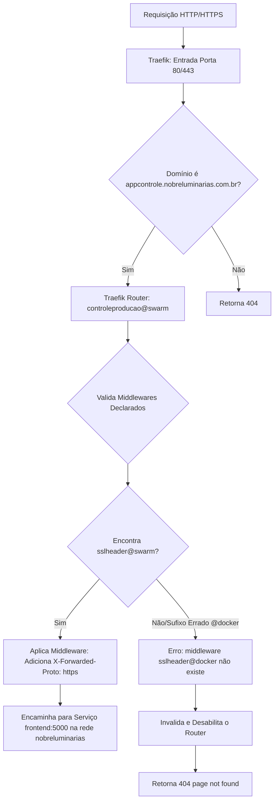

# Plano de Implementação: Correção de Roteamento Traefik no Docker Swarm

Este documento detalha o diagnóstico do erro `404 page not found` ocorrido após o deploy na VPS da Hostinger, e a correção efetuada no mapeamento de middlewares do Traefik.

## 🎯 Objetivo
- Solucionar a falha de roteamento HTTP/HTTPS do Traefik para o domínio `appcontrole.nobreluminarias.com.br`.
- Corrigir a declaração do middleware `sslheader` no Docker Compose Swarm para que o Traefik encontre-o usando o provedor `@swarm` (Swarm Mode).

---

## 🗺️ Mapa de Fluxo

### Fluxo de Roteamento e Resolução de Middleware do Traefik

---

## 🛠️ Alterações Efetuadas

### 1. Docker Compose Swarm: `docker-compose.swarm.yml`
- **Label de Middleware**:
  - Linha 22: Alterado de `traefik.http.routers.controleproducao.middlewares: sslheader@docker` para `traefik.http.routers.controleproducao.middlewares: sslheader@swarm`.
- **Raciocínio**: No modo Docker Swarm, o Traefik registra os middlewares criados dinamicamente na stack sob o escopo do provedor `swarm`. Referenciar `@docker` fazia o Traefik procurar o middleware em outro escopo inexistente, resultando em erro e desativação da rota.
