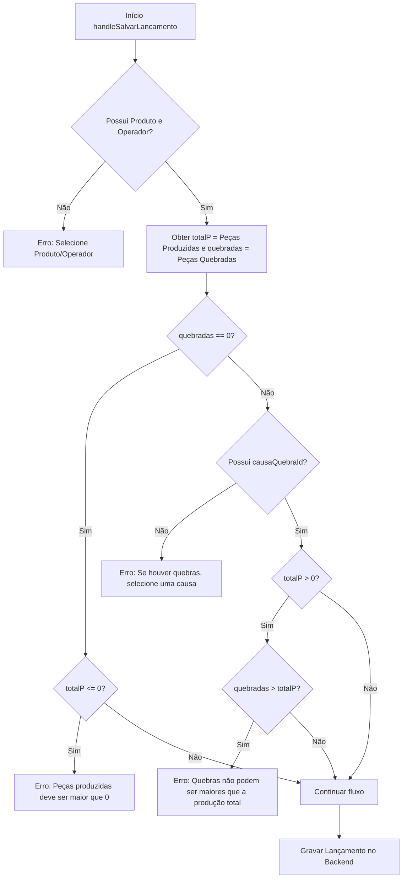
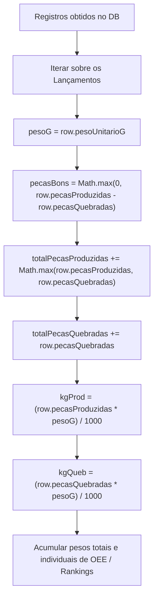

# Plano de Implementação: Lançamento Apenas de Quebras no Repuxo

Este documento detalha o plano de alteração para permitir que lançamentos no módulo de repuxo sejam realizados sem peças produzidas (ou seja, apenas quebras) quando uma causa de quebra estiver detectada, ajustando também os relatórios para a exibição correta de peças, pesos e taxas de quebra.

## 🎯 Objetivo
Permitir que o operador cadastre lançamentos na rota `/repuxo/lancamento` contendo `0` em "Peças Produzidas" (peças boas), informando uma quantidade de quebras e a correspondente causa de quebra. Ajustar as fórmulas do frontend e do backend para evitar inconsistências matemáticas (como divisões por zero ou valores de peças boas negativas) e calcular corretamente o peso das quebras e a taxa de quebra de lote/período.

---

## 🗺️ Mapa de Fluxo

### 1. Validação do Formulário no Frontend (`handleSalvarLancamento`)

### 2. Fluxo de Cálculos e Estatísticas no Backend / Relatório

---

## 🛠️ Alterações Propostas

### 1. Frontend: Ajuste da Validação em `LancamentoRepuxados.tsx`
- Permitir que `pecasProduzidas` seja `0` quando `pecasQuebradas > 0` e houver uma causa de quebra.
- Se `pecasQuebradas === 0`, as peças produzidas ainda devem ser maiores que `0`.
- Se `pecasProduzidas > 0`, a quantidade de quebras não pode ser maior que `pecasProduzidas`.

### 2. Frontend: Exibição da Quantidade e Peso das Quebras na Tabela/Cards
- Modificar o cálculo da taxa de quebra do lote (`pctQ`) para usar `Math.max(l.pecasProduzidas, l.pecasQuebradas)` como divisor. Assim, se `pecasProduzidas = 0` e `pecasQuebradas = 5`, a quebra delote será exibida como `100%` (e não `0%`).
- Exibir na coluna "Quebras (%)" da tabela e no card mobile a quantidade e o peso em kg correspondentes às quebras: `l.pecasQuebradas pçs (kgQueb.toFixed(1) kg)`.

### 3. Backend: Cálculos de Peças Boas e Totais em `server/db-repuxados.ts` e `server/db-jornada.ts`
- Garantir que `pecasBons` nunca seja menor que zero usando `Math.max(0, row.pecasProduzidas - row.pecasQuebradas)`.
- Ajustar os acumuladores de total de peças nos rankings e diários para usar `Math.max(row.pecasProduzidas, row.pecasQuebradas)` como divisor do cálculo de taxas e no volume de peças processadas pelo operador/produto no período.

---

## 🛡️ Segurança e Casos Limite
- **Divisão por zero:** Evitada usando verificações robustas como `Math.max(...) > 0`.
- **Valores negativos:** Evitados com o uso de `Math.max(0, ...)`.
- **Integridade dos dados históricos:** A mudança não altera registros antigos, mas melhora a resiliência caso os antigos possuíssem alguma inconsistência.
