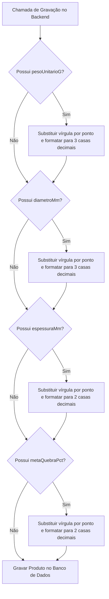
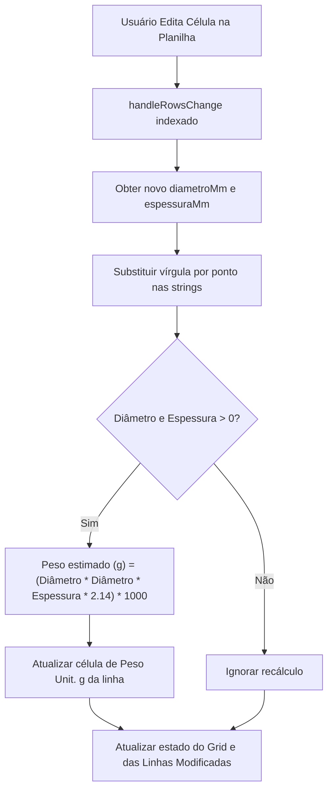

# Plano de Implementação: Validação de Decimais e Cadastro de Produtos

Este documento detalha o plano de alteração e a lógica implementada para garantir que os campos decimais como Diâmetro, Espessura, Peso Unitário e Meta de Quebra sejam sempre validados e gravados com a precisão correta no banco de dados, independentemente de estarem em formato de modal ou planilha.

## 🎯 Objetivo
- Impedir inconsistências de formatação decimal devido ao uso de vírgula `,` ou ponto `.` no cadastro de produtos.
- Garantir que no banco de dados os decimais sejam sempre convertidos para ponto e limitados à sua respectiva precisão do schema:
  - `pesoUnitarioG`: 3 casas decimais (ex: `61.800`).
  - `diametroMm`: 3 casas decimais (ex: `0.190`).
  - `espessuraMm`: 2 casas decimais (ex: `0.80`).
  - `metaQuebraPct`: 2 casas decimais (ex: `1.00`).
- Atualizar a label da coluna da planilha de `Diâmetro (mm)` para `Diâmetro (m)` para corresponder à realidade física dos dados (metros).
- Recalcular automaticamente o peso estimado em gramas na planilha se o usuário alterar diâmetro ou espessura.

---

## 🗺️ Mapa de Fluxo

### 1. Sanitização e Gravação de Decimais no Backend

### 2. Recálculo Automático de Peso na Planilha

---

## 🛠️ Alterações Efetuadas

### 1. Frontend: `ProductsQuery.tsx`
- **Modal de Edição**:
  - `handleSaveEdit`: Adicionada conversão de vírgula para ponto e arredondamento estrito via `.toFixed` antes de chamar a mutação de gravação.
- **Tabela / Planilha**:
  - `columns`: Corrigido nome da coluna Diâmetro para `Diâmetro (m)`.
  - `handleRowsChange`: Implementado recálculo dinâmico e imediato do peso estimado em gramas caso diâmetro ou espessura mudem, além de padronizar as entradas numéricas substituindo vírgula por ponto no estado.
  - `handleSaveGrid`: Sanitizados todos os campos decimais que vão para o backend com conversão para ponto e fixação de casas decimais correspondentes.

### 2. Backend: `server/db.ts`
- **Gravação Centralizada**:
  - `createOrUpdateProduct` e `updateProductByCode`: Incluídas validações do tipo "Safety by Default". Se algum dado contendo vírgulas ou precisão inválida passar das validações do frontend, o backend converte, arredonda e grava no MySQL de forma limpa.
