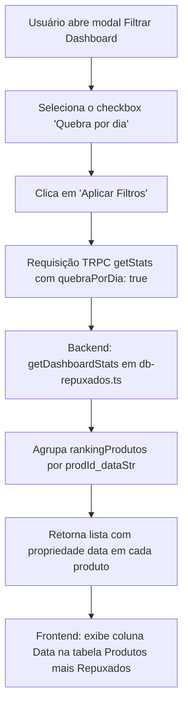

# Funcionalidade: Quebra por Dia no Relatório de Produtos mais Repuxados

## 📋 Visão Geral
Esta funcionalidade adiciona a opção de **Quebra por dia** no modal de **Filtros Avançados** da tela de Dashboard de Repuxo (`/repuxo/dashboard`). Quando ativada, a tabela "Produtos mais Repuxados" agrupa os apontamentos de produção por produto e por dia individual no intervalo filtrado, exibindo a data correspondente e permitindo ordenação.

---

## 🔀 Mapa de Fluxo de Dados e Execução

---

## 🛠️ Modificações Realizadas

1. **Backend ([db-repuxados.ts](file:///c:/Users/feliperosa/controle-de-producao/Controle-de-Producao/server/db-repuxados.ts))**:
   - Atualizada assinatura dos filtros de `getDashboardStats` para aceitar `quebraPorDia?: boolean | null`.
   - Atualizado o loop de agregação `rankingProdutos` para usar a chave `${prodId}_${dataStr}` quando `quebraPorDia` estiver ativo.
   - Adicionada a propriedade `data` nos itens retornados e ajustada a ordenação padrão para datas mais recentes primeiro quando ativado.

2. **API/TRPC ([routers.ts](file:///c:/Users/feliperosa/controle-de-producao/Controle-de-Producao/server/routers.ts))**:
   - Adicionada a validação do campo `quebraPorDia` no schema Zod do procedimento `getStats`.

3. **Frontend ([DashboardRepuxo.tsx](file:///c:/Users/feliperosa/controle-de-producao/Controle-de-Producao/client/src/pages/DashboardRepuxo.tsx))**:
   - Adicionado o componente `Checkbox` no modal de Filtros Avançados (`Filtrar Dashboard`).
   - Criados os estados `quebraPorDia` e `tempQuebraPorDia`.
   - Adicionada a badge visual nos filtros ativos para o status de "Quebra por dia".
   - Adicionada dinamicamente a coluna **Data** no cabeçalho e corpo da tabela "Produtos mais Repuxados" quando a opção estiver ativada, além de suporte para ordenação clicando na coluna Data.
