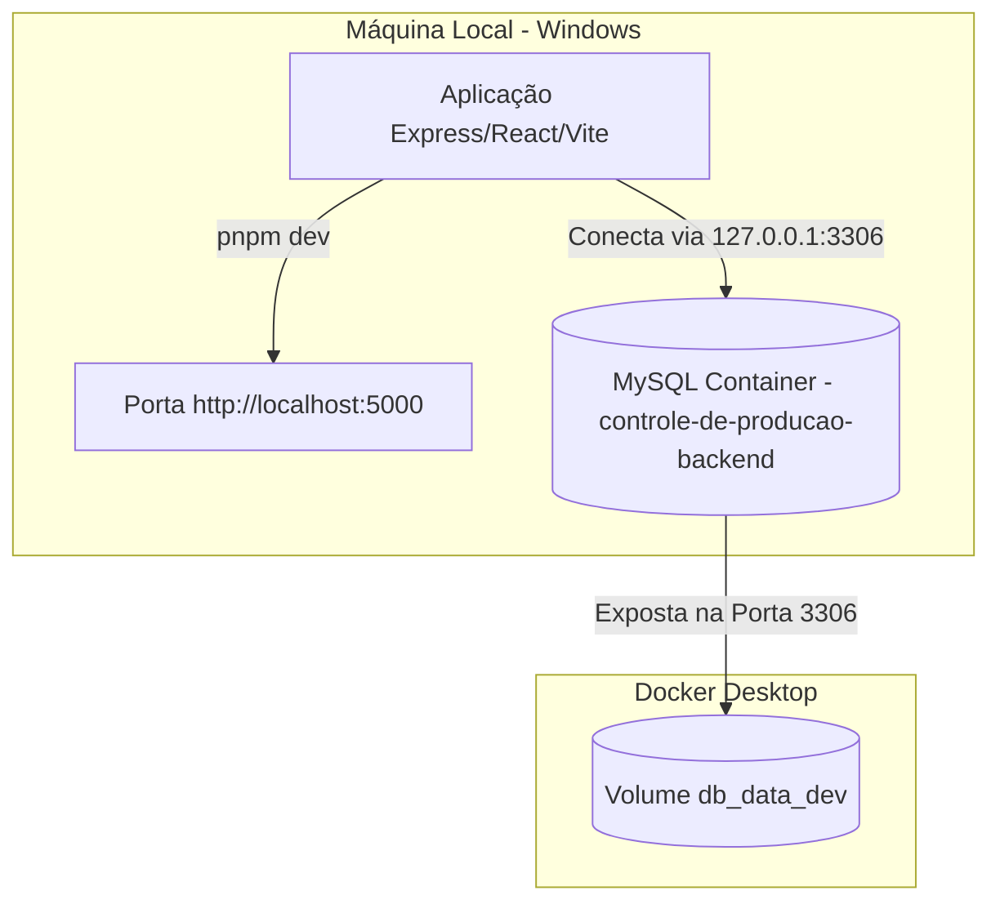
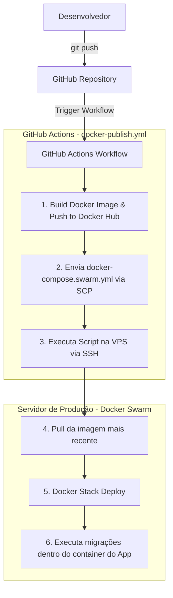

# Configuração de Desenvolvimento e Deploy - Controle de Produção

Este documento detalha a arquitetura de desenvolvimento local e o pipeline de integração contínua (CI/CD) para produção.

## 🛠️ Arquitetura de Execução Local

No ambiente de desenvolvimento local no Windows, o banco de dados MySQL roda de forma isolada dentro de um container Docker, enquanto a aplicação principal (Express + React) é executada diretamente no host nativo utilizando o comando `pnpm dev`.



### Como Executar Localmente (Fluxo Rápido de Desenvolvimento)

Para agilizar o desenvolvimento, a aplicação roda nativamente no host (Windows) para suporte a *Hot Reload* instantâneo, enquanto o banco de dados roda isolado no Docker.

Você pode executar os seguintes comandos **diretamente da pasta raiz** da workspace:

1. **Subir o banco de dados (MySQL) no Docker em segundo plano:**
   ```bash
   pnpm db:up
   ```
   *Nota: Esse comando inicia apenas o container MySQL na porta 3306. Leva de 1 a 2 segundos.*

2. **Iniciar o servidor de desenvolvimento e o frontend localmente:**
   ```bash
   pnpm dev
   ```
   *Qualquer alteração de arquivo será refletida em milissegundos no navegador em http://localhost:5000.*

---

### Opção Alternativa: Executar Tudo no Docker (Frontend + Banco)

Se preferir rodar a stack completa no Docker (sem ter o Node/pnpm instalados nativamente na máquina), você pode usar o comando abaixo a partir da raiz:

```bash
pnpm docker:dev
```
*Atenção: Esse método consome mais recursos e pode demorar alguns minutos para inicializar.*

Para desligar e limpar os containers do Docker de qualquer um dos modos:
```bash
pnpm docker:dev:down
```

---

## 🚀 Fluxo de Deploy Contínuo (CI/CD)

O deploy automático para a VPS é gerenciado via **GitHub Actions** quando novos commits são enviados para as branches principais.



### Detalhes do Pipeline de Produção

1. **Gatilhos (Triggers):**
   - Push na branch `main` ou `master`.
   - Push de tags que iniciam com `v*` (ex: `v1.0.0`).
   - Pull Requests para `main` ou `master` (executa apenas build de validação, sem deploy).

2. **Docker Hub:**
   - A imagem construída é enviada para o Docker Hub com a tag correspondente e também atualiza a tag `:latest`.

3. **Deploy na VPS:**
   - O pipeline envia o arquivo `docker-compose.swarm.yml` para a VPS em `/root/controle-de-producao/`.
   - Conecta via SSH e executa o deploy no Docker Swarm (`docker stack deploy`).
   - Força a atualização do serviço para usar a nova imagem.
   - Aguarda o container do banco de dados estar saudável.
   - Executa as migrações de forma segura executando o script `dist/migrate.js` dentro do container da aplicação principal.
